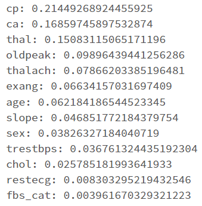
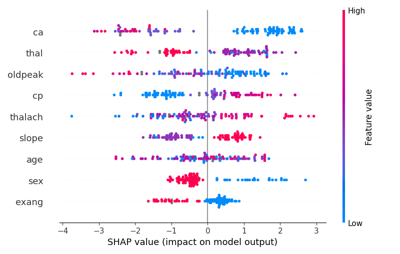
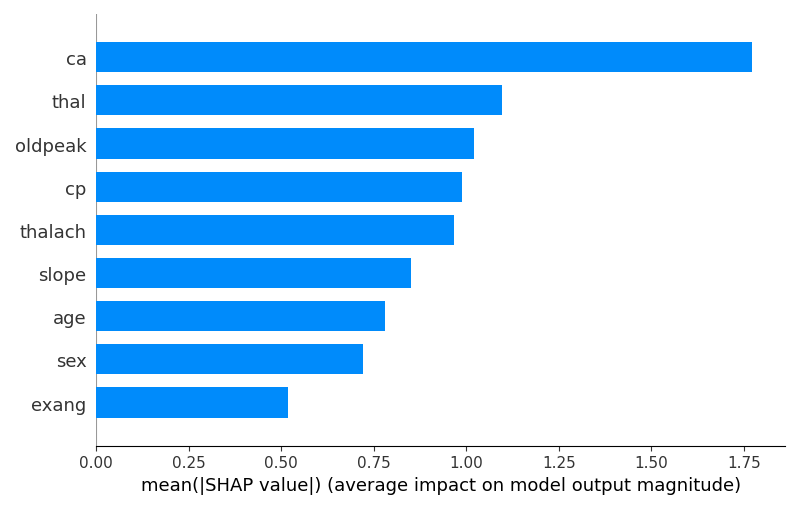

# Heart Disease Prediction Model Development
Exploratory data analysis, model development and model explainability for the <a href="https://github.com/leo-cb/HeartDiseasePrediction_WebApp">heart disease web application</a>. The EDA and modelling (Logistic regression, AutoML and Gradient-boosted Trees) were performed in Azure Databricks (files in Databricks_workspace), and tracked with MLFlow.  

Posteriorely, the GBT model was replicated in the local environment, in create_model.py, which saves the model and all the used datasets to /data/. The model explainability was implemented with SHAP in explain_model.py.

# Getting Started
  
## Dependencies

If you wish to run with docker:

### Docker

**Linux:**
To install Docker on Linux, follow the instructions for your specific distribution on the [Docker website](https://docs.docker.com/engine/install/).

**Windows:**
If you're using Windows, you can install Docker Desktop by downloading it from the [Docker Desktop for Windows](https://www.docker.com/products/docker-desktop) page.

## Installing

### Without Docker container

To install this application without using a docker container, follow these steps:  

1. Clone this repository to your local machine:
   ```shell
   git clone https://github.com/leo-cb/HeartDiseasePrediction_ModelDev.git  
2. Install dependencies:
   ```shell
   pip install -r requirements.txt

### With docker container

To install this application using docker, follow these steps:

1. Clone this repository to your local machine:
   ```shell
   git clone https://github.com/leo-cb/HeartDiseasePrediction_ModelDev.git
2. Create docker image:
   ```shell
   docker build -t heartdisease_modeldev .

## Executing program

### Without docker

To run the scripts without docker, follow these steps:

1. Execute create_model.py to create the GBT model and output it to /data/:
   ```shell
   python create_model.py
2. Execute explain_model.py to output the SHAP plots to /images/ and show them:
   ```shell
   python explain_model.py --show-plots

### With docker

To run the scripts with docker, follow these steps:

1. Execute create_model.py to create the GBT model and output it to /data/:
   ```shell
   docker run -it heartdisease_modeldev:latest python create_model.py
2. Execute explain_model.py to output the SHAP plots to /images/:
   ```shell
   docker run -it heartdisease_modeldev:latest python explain_model.py

# Description

The following steps were taken:

## Exploratory data analysis done in Azure Databricks with Pyspark

**Files:** Databricks_workspace/eda.ipynb

**Databricks workspace**


**Feature importances**



## Modelling and model tracking with MLFlow

Modelling was performed with Logistic Regression, AutoML and Gradient-boosted Trees models in Azure Databricks with Pyspark. 
Model tracking performed with MLFlow. 
The chosen model for production was the one with the highest AUC in the test set (GBT with 9 features corresponding to the 9 highest feature importances).

**Files:**: Databricks_workspace/model.py

**Logistic Regression in MLFlow**


**GBT in MLFlow**


**Runs with different feature sets in MLFlow**


**F1-score between different MLFlow runs**


## Local GBT model creation


**Files:** create_model.py


## ML explainability with Shapley

**Files:** explain_model.py

**SHAP Summary plot**  



**SHAP Bar plot**



## Containerization with Docker

**Files:** Dockerfile
